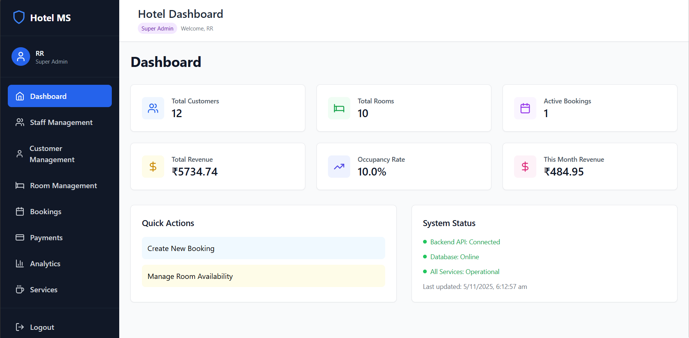
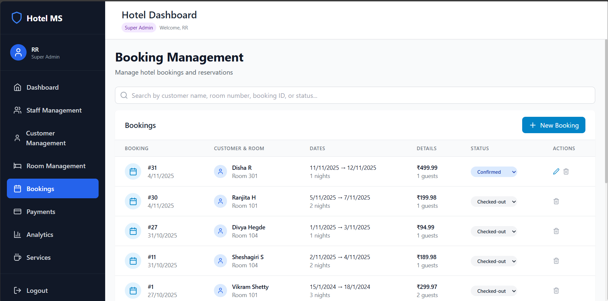
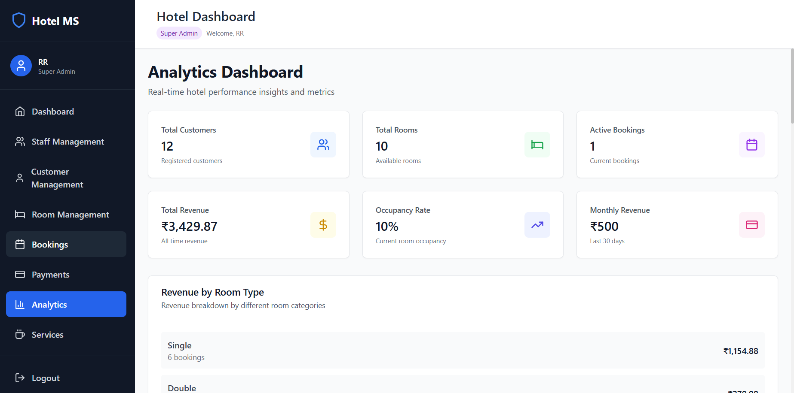

# 🏨 Hotel Management System

A comprehensive full-stack web application designed to streamline and automate hotel operations including staff management, room bookings, customer management, payments, and analytics.

[](https://reactjs.org/)
[](https://nodejs.org/)
[](https://expressjs.com/)
[](https://www.mysql.com/)
[](LICENSE)

---

## 📋 Table of Contents

- [Overview](#overview)
- [Features](#features)
- [Technology Stack](#technology-stack)
- [Project Structure](#project-structure)
- [Database Schema](#database-schema)
- [Installation & Setup](#installation--setup)
- [Usage](#usage)
- [API Endpoints](#api-endpoints)
- [Screenshots](#screenshots)
- [Advanced Features](#advanced-features)
- [Contributing](#contributing)
- [License](#license)

---

## 🎯 Overview

The **Hotel Management System** is a modern, database-driven web application built to manage all aspects of hotel operations efficiently. It provides an intuitive interface for managing staff, customers, rooms, bookings, payments, and services with real-time analytics and role-based access control.

### 🎓 Academic Project
- **Course:** Database Management System (UE23CS351A)
- **Institution:** Computer Science and Engineering Department
- **Academic Year:** 2024-2025
- **Semester:** 5th Semester

### ✨ Key Highlights

- **Full-Stack Application** with React frontend and Node.js/Express backend
- **MySQL Database** with normalized schema (3NF)
- **Role-Based Access Control** (Super Admin, Admin, Manager, Receptionist)
- **5 Database Triggers** for automatic operations
- **6 Stored Procedures** for complex business logic
- **Real-Time Analytics Dashboard** with charts and metrics
- **Indian Localization** (₹ currency, Karnataka region names)
- **Responsive Design** using Tailwind CSS

---

## 🚀 Features

### Core Modules

#### 👥 Staff Management
- Add, edit, and delete staff members
- Role-based access control (4 roles)
- Salary management
- Staff audit logging
- Search and filter functionality

#### 🧑‍💼 Customer Management
- Complete customer profiles
- Contact information tracking
- Customer loyalty points system
- Booking history per customer
- Customer analytics

#### 🏠 Room Management
- 5 room categories (Deluxe, Suite, Standard, Executive, Presidential)
- Real-time availability checking
- Price management per room type
- Room status tracking (Available, Occupied, Maintenance)
- Floor-wise organization

#### 📅 Booking Management
- Create and manage reservations
- Automatic room availability verification
- Booking status tracking (Confirmed, Checked-In, Checked-Out, Cancelled)
- Check-in/Check-out date management
- Booking modification and cancellation

#### 💳 Payment Management
- Multiple payment methods (Cash, Credit Card, Debit Card, UPI, Net Banking)
- Payment status tracking
- Payment history
- Revenue calculation
- Receipt generation

#### 🛎️ Services Management
- 16 hotel services (Restaurant, Spa, Gym, Laundry, etc.)
- Service booking integration
- Service pricing
- Service availability management

#### 📊 Analytics Dashboard
- Revenue tracking and trends
- Occupancy rate monitoring
- Customer insights
- Popular room types analysis
- Payment method distribution
- Monthly/yearly statistics

---

## 🛠️ Technology Stack

### Frontend
```
├── React 18.2.0          # UI Library
├── React Router 6.20.1   # Client-side routing
├── Vite 4.5.0           # Build tool
├── Tailwind CSS 3.3.5   # CSS framework
├── Lucide React         # Icon library
├── Axios 1.6.2          # HTTP client
└── Recharts 3.3.0       # Charts library
```

### Backend
```
├── Node.js 20.17.0      # Runtime environment
├── Express.js 4.18.2    # Web framework
├── MySQL2 3.6.0         # MySQL client
└── CORS 2.8.5           # Cross-origin middleware
```

### Database
```
└── MySQL 8.0+           # Relational database
```

### Development Tools
```
├── Git                  # Version control
├── npm                  # Package manager
├── VS Code              # Code editor
└── MySQL Workbench      # Database management
```

---

## 📁 Project Structure

```
hotel_management_system/
│
├── hotel-management-backend/       # Backend (Node.js + Express)
│   ├── server.js                  # Main server file
│   ├── package.json               # Backend dependencies
│   │
│   ├── database/                  # Database files
│   │   ├── connection.js          # MySQL connection
│   │   ├── setup.sql              # Database schema
│   │   ├── procedures.sql         # Stored procedures
│   │   └── triggers.sql           # Database triggers
│   │
│   ├── routes/                    # API routes
│   │   ├── auth.js                # Authentication
│   │   ├── staff.js               # Staff endpoints
│   │   ├── customers.js           # Customer endpoints
│   │   ├── rooms.js               # Room endpoints
│   │   ├── bookings.js            # Booking endpoints
│   │   ├── payments.js            # Payment endpoints
│   │   ├── services.js            # Service endpoints
│   │   ├── analytics.js           # Analytics endpoints
│   │   └── procedures.js          # Stored procedure calls
│   │
│   └── utils/                     # Utility functions
│       └── helpers.js
│
├── hotel-management-frontend/      # Frontend (React + Vite)
│   ├── index.html                 # HTML entry point
│   ├── package.json               # Frontend dependencies
│   ├── vite.config.js             # Vite configuration
│   ├── tailwind.config.js         # Tailwind configuration
│   │
│   └── src/                       # Source files
│       ├── main.jsx               # React entry point
│       ├── App.jsx                # Main App component
│       ├── index.css              # Global styles
│       │
│       ├── components/            # Reusable components
│       │   ├── common/            # Common components
│       │   │   ├── Header.jsx
│       │   │   ├── Sidebar.jsx
│       │   │   ├── Layout.jsx
│       │   │   ├── Modal.jsx
│       │   │   ├── LoadingSpinner.jsx
│       │   │   └── ProtectedRoute.jsx
│       │   │
│       │   ├── forms/             # Form components
│       │   │   ├── LoginForm.jsx
│       │   │   ├── StaffForm.jsx
│       │   │   ├── CustomerForm.jsx
│       │   │   ├── RoomForm.jsx
│       │   │   ├── BookingForm.jsx
│       │   │   └── PaymentForm.jsx
│       │   │
│       │   └── tables/            # Table components
│       │       ├── StaffTable.jsx
│       │       ├── CustomersTable.jsx
│       │       ├── RoomsTable.jsx
│       │       ├── BookingsTable.jsx
│       │       └── PaymentsTable.jsx
│       │
│       ├── pages/                 # Page components
│       │   ├── Dashboard.jsx
│       │   ├── Auth/
│       │   │   └── Login.jsx
│       │   ├── Staff/
│       │   │   ├── StaffList.jsx
│       │   │   ├── StaffFormPage.jsx
│       │   │   └── StaffAuditLog.jsx
│       │   ├── Customers/
│       │   │   ├── CustomersList.jsx
│       │   │   └── CustomerFormPage.jsx
│       │   ├── Rooms/
│       │   │   ├── RoomsList.jsx
│       │   │   └── RoomFormPage.jsx
│       │   ├── Bookings/
│       │   │   ├── BookingsList.jsx
│       │   │   └── BookingFormPage.jsx
│       │   ├── Payments/
│       │   │   └── PaymentsList.jsx
│       │   ├── Services/
│       │   │   └── ServicesList.jsx
│       │   └── Analytics/
│       │       └── AnalyticsDashboard.jsx
│       │
│       ├── context/               # React Context
│       │   └── AuthContext.jsx    # Authentication context
│       │
│       ├── hooks/                 # Custom hooks
│       │   └── useAuth.js
│       │
│       ├── services/              # API services
│       │   └── api.js             # Axios configuration
│       │
│       └── utils/                 # Utility functions
│           └── helpers.js
│
├── Documentation Files            # Project documentation
│   ├── Hotel_Management_System_Documentation.md
│   ├── PROJECT_REPORT.md
│   ├── TESTING_GUIDE.md
│   ├── TRIGGERS_PROCEDURES_DOCUMENTATION.md
│   ├── STORED_PROCEDURES_TRIGGERS_INTEGRATION.md
│   ├── BUG_FIXES_LOG.md
│   └── CONNECTION_ISSUE_FIX.md
│
├── .gitignore                     # Git ignore file
└── README.md                      # This file
```

---

## 🗄️ Database Schema

### Core Tables (7 Tables)

#### 1. **staff**
```sql
- staff_id (Primary Key, Auto-increment)
- name (VARCHAR, NOT NULL)
- role (ENUM: 'Super Admin', 'Admin', 'Manager', 'Receptionist')
- email (VARCHAR, UNIQUE)
- phone (VARCHAR)
- salary (DECIMAL)
- hire_date (DATE)
- password (VARCHAR)
```

#### 2. **customers**
```sql
- customer_id (Primary Key, Auto-increment)
- name (VARCHAR, NOT NULL)
- email (VARCHAR, UNIQUE)
- phone (VARCHAR)
- address (TEXT)
- id_proof (VARCHAR)
- loyalty_points (INT, Default: 0)
```

#### 3. **rooms**
```sql
- room_id (Primary Key, Auto-increment)
- room_number (VARCHAR, UNIQUE)
- room_type (VARCHAR)
- price_per_night (DECIMAL)
- status (ENUM: 'Available', 'Occupied', 'Maintenance')
- floor (INT)
- amenities (TEXT)
```

#### 4. **bookings**
```sql
- booking_id (Primary Key, Auto-increment)
- customer_id (Foreign Key -> customers)
- room_id (Foreign Key -> rooms)
- check_in_date (DATE)
- check_out_date (DATE)
- total_amount (DECIMAL)
- status (ENUM: 'Confirmed', 'Checked-In', 'Checked-Out', 'Cancelled')
- created_at (TIMESTAMP)
```

#### 5. **payments**
```sql
- payment_id (Primary Key, Auto-increment)
- booking_id (Foreign Key -> bookings)
- amount (DECIMAL)
- payment_date (DATE)
- payment_method (ENUM: 'Cash', 'Credit Card', 'Debit Card', 'UPI', 'Net Banking')
- status (VARCHAR)
```

#### 6. **services**
```sql
- service_id (Primary Key, Auto-increment)
- name (VARCHAR, NOT NULL)
- description (TEXT)
- price (DECIMAL)
- available (BOOLEAN, Default: TRUE)
```

#### 7. **staff_audit**
```sql
- audit_id (Primary Key, Auto-increment)
- staff_id (INT)
- action (VARCHAR)
- old_name (VARCHAR)
- new_name (VARCHAR)
- old_role (VARCHAR)
- new_role (VARCHAR)
- changed_at (TIMESTAMP)
```

### Relationships
- `bookings.customer_id` → `customers.customer_id` (Many-to-One)
- `bookings.room_id` → `rooms.room_id` (Many-to-One)
- `payments.booking_id` → `bookings.booking_id` (One-to-One/Many)
- `booking_services.booking_id` → `bookings.booking_id` (Many-to-One)
- `booking_services.service_id` → `services.service_id` (Many-to-One)

---

## 💻 Installation & Setup

### Prerequisites

Before you begin, ensure you have the following installed:
- **Node.js** (v20.x or higher) - [Download](https://nodejs.org/)
- **MySQL** (v8.0 or higher) - [Download](https://www.mysql.com/)
- **Git** - [Download](https://git-scm.com/)
- **npm** (comes with Node.js)

### Step 1: Clone the Repository

```bash
git clone https://github.com/shruthanaj/HMS.git
cd HMS
```

### Step 2: Database Setup

1. **Start MySQL Server**
   ```bash
   # On Windows
   net start MySQL80
   
   # On Mac/Linux
   sudo systemctl start mysql
   ```

2. **Create Database and Import Schema**
   ```bash
   mysql -u root -p
   ```
   
   ```sql
   CREATE DATABASE hotel_management;
   USE hotel_management;
   SOURCE hotel_management_system/hotel-management-backend/database/setup.sql;
   SOURCE hotel_management_system/hotel-management-backend/database/procedures.sql;
   SOURCE hotel_management_system/hotel-management-backend/database/triggers.sql;
   ```

3. **Update Database Connection**
   
   Edit `hotel_management_system/hotel-management-backend/database/connection.js`:
   ```javascript
   const connection = mysql.createConnection({
     host: 'localhost',
     user: 'root',           // Your MySQL username
     password: 'your_password',  // Your MySQL password
     database: 'hotel_management'
   });
   ```

### Step 3: Backend Setup

```bash
cd hotel_management_system/hotel-management-backend
npm install
npm start
```

The backend server will start on `http://localhost:3000`

### Step 4: Frontend Setup

Open a new terminal:

```bash
cd hotel_management_system/hotel-management-frontend
npm install
npm run dev
```

The frontend application will start on `http://localhost:5173`

### Step 5: Access the Application

1. Open your browser and navigate to: `http://localhost:5173`
2. Login with default credentials:
   - **Email:** `radha.krishna@example.com`
   - **Password:** `password123`
   - **Role:** Super Admin

---

## 📖 Usage

### Default Login Credentials

The system comes with pre-populated staff data. Here are some default login credentials:

| Name | Email | Password | Role |
|------|-------|----------|------|
| Radha Krishna | radha.krishna@example.com | password123 | Super Admin |
| Gowri Shankar | gowri.shankar@example.com | password123 | Admin |
| Lakshmi Narayan | lakshmi.narayan@example.com | password123 | Manager |
| Sita Ramachandran | sita.ramachandran@example.com | password123 | Receptionist |

### Navigation

After login, you'll have access to:

1. **Dashboard** - Overview of hotel operations
2. **Staff Management** - Manage hotel staff
3. **Customers** - Customer database
4. **Rooms** - Room inventory
5. **Bookings** - Reservation management
6. **Payments** - Payment tracking
7. **Services** - Hotel services
8. **Analytics** - Business insights

### Creating a New Booking

1. Navigate to **Bookings** → **New Booking**
2. Select a customer (or create new)
3. Choose available room
4. Set check-in and check-out dates
5. System automatically calculates total amount
6. Confirm booking

### Making a Payment

1. Navigate to **Payments** → **New Payment**
2. Select the booking
3. Enter payment amount
4. Choose payment method
5. Submit payment

---

## 🔌 API Endpoints

### Authentication
```
POST   /api/auth/login              # User login
GET    /api/auth/verify             # Verify token
```

### Staff
```
GET    /api/staff                   # Get all staff
GET    /api/staff/:id               # Get staff by ID
POST   /api/staff                   # Create new staff
PUT    /api/staff/:id               # Update staff
DELETE /api/staff/:id               # Delete staff
GET    /api/staff/audit-logs        # Get audit logs
```

### Customers
```
GET    /api/customers               # Get all customers
GET    /api/customers/:id           # Get customer by ID
POST   /api/customers               # Create new customer
PUT    /api/customers/:id           # Update customer
DELETE /api/customers/:id           # Delete customer
```

### Rooms
```
GET    /api/rooms                   # Get all rooms
GET    /api/rooms/:id               # Get room by ID
GET    /api/rooms/available         # Get available rooms
POST   /api/rooms                   # Create new room
PUT    /api/rooms/:id               # Update room
DELETE /api/rooms/:id               # Delete room
```

### Bookings
```
GET    /api/bookings                # Get all bookings
GET    /api/bookings/:id            # Get booking by ID
POST   /api/bookings                # Create new booking
PUT    /api/bookings/:id            # Update booking
DELETE /api/bookings/:id            # Cancel booking
```

### Payments
```
GET    /api/payments                # Get all payments
GET    /api/payments/:id            # Get payment by ID
POST   /api/payments                # Create new payment
```

### Services
```
GET    /api/services                # Get all services
GET    /api/services/:id            # Get service by ID
POST   /api/services                # Create new service
PUT    /api/services/:id            # Update service
DELETE /api/services/:id            # Delete service
```

### Analytics
```
GET    /api/analytics/dashboard     # Dashboard metrics
GET    /api/analytics/revenue       # Revenue statistics
GET    /api/analytics/occupancy     # Occupancy rates
```

### Stored Procedures
```
POST   /api/procedures/available-rooms          # Check room availability
POST   /api/procedures/customer-booking-history # Get customer history
POST   /api/procedures/total-revenue            # Calculate revenue
POST   /api/procedures/staff-by-role            # Get staff by role
POST   /api/procedures/room-revenue             # Room-wise revenue
POST   /api/procedures/update-loyalty-points    # Update points
```

---

## 🎨 Screenshots

### Dashboard


### Bookings Management


### Analytics Dashboard


---

## 🔥 Advanced Features

### 1. Database Triggers (5 Triggers)

#### Trigger 1: `before_booking_insert`
- **Purpose:** Validates room availability before booking
- **Event:** BEFORE INSERT on bookings
- **Action:** Checks if room is available for selected dates

#### Trigger 2: `after_booking_insert`
- **Purpose:** Updates room status after booking confirmation
- **Event:** AFTER INSERT on bookings
- **Action:** Sets room status to 'Occupied'

#### Trigger 3: `after_payment_insert`
- **Purpose:** Updates booking payment status
- **Event:** AFTER INSERT on payments
- **Action:** Marks booking as 'Paid'

#### Trigger 4: `before_staff_update`
- **Purpose:** Logs staff changes for audit trail
- **Event:** BEFORE UPDATE on staff
- **Action:** Records old and new values in staff_audit table

#### Trigger 5: `after_booking_checkout`
- **Purpose:** Updates room status on checkout
- **Event:** AFTER UPDATE on bookings
- **Action:** Sets room status to 'Available' when booking is checked out

### 2. Stored Procedures (6 Procedures)

#### Procedure 1: `GetAvailableRooms`
```sql
CALL GetAvailableRooms('2025-11-10', '2025-11-15');
```
Returns all rooms available for given date range.

#### Procedure 2: `GetCustomerBookingHistory`
```sql
CALL GetCustomerBookingHistory(1);
```
Returns complete booking history for a customer.

#### Procedure 3: `CalculateTotalRevenue`
```sql
CALL CalculateTotalRevenue('2025-01-01', '2025-12-31');
```
Calculates total revenue for a date range.

#### Procedure 4: `GetStaffByRole`
```sql
CALL GetStaffByRole('Admin');
```
Returns all staff members with specified role.

#### Procedure 5: `GetRoomRevenue`
```sql
CALL GetRoomRevenue();
```
Returns revenue generated by each room.

#### Procedure 6: `UpdateCustomerLoyaltyPoints`
```sql
CALL UpdateCustomerLoyaltyPoints(1, 100);
```
Adds loyalty points to customer account.

### 3. Role-Based Access Control

| Feature | Super Admin | Admin | Manager | Receptionist |
|---------|-------------|-------|---------|--------------|
| View Dashboard | ✅ | ✅ | ✅ | ✅ |
| Manage Staff | ✅ | ✅ | ❌ | ❌ |
| Manage Customers | ✅ | ✅ | ✅ | ✅ |
| Manage Rooms | ✅ | ✅ | ✅ | ❌ |
| Create Bookings | ✅ | ✅ | ✅ | ✅ |
| Process Payments | ✅ | ✅ | ✅ | ✅ |
| View Analytics | ✅ | ✅ | ✅ | ❌ |
| Manage Services | ✅ | ✅ | ✅ | ❌ |


## 🧪 Testing

### Running Tests

The system includes comprehensive testing documentation. See [TESTING_GUIDE.md](hotel_management_system/TESTING_GUIDE.md) for:
- Unit testing procedures
- Integration testing
- API endpoint testing
- Database trigger testing
- Stored procedure testing

### Test Credentials

Test user accounts are available in the database. All test users use password: `password123`

---

## 📚 Documentation

Detailed documentation is available in the following files:

1. **[Hotel_Management_System_Documentation.md](hotel_management_system/Hotel_Management_System_Documentation.md)** - Complete system documentation
2. **[PROJECT_REPORT.md](hotel_management_system/PROJECT_REPORT.md)** - Academic project report
3. **[TESTING_GUIDE.md](hotel_management_system/TESTING_GUIDE.md)** - Testing procedures
4. **[TRIGGERS_PROCEDURES_DOCUMENTATION.md](hotel_management_system/TRIGGERS_PROCEDURES_DOCUMENTATION.md)** - Database triggers and procedures
5. **[BUG_FIXES_LOG.md](hotel_management_system/BUG_FIXES_LOG.md)** - Bug tracking and fixes

---

## 🤝 Contributing

Contributions are welcome! Please follow these steps:

1. Fork the repository
2. Create a new branch (`git checkout -b feature/YourFeature`)
3. Make your changes
4. Commit your changes (`git commit -m 'Add some feature'`)
5. Push to the branch (`git push origin feature/YourFeature`)
6. Open a Pull Request

### Coding Standards

- Follow JavaScript ES6+ standards
- Use meaningful variable and function names
- Comment complex logic
- Maintain consistent indentation (2 spaces)
- Write descriptive commit messages

---

## 🐛 Known Issues & Limitations

1. **Session Management:** Currently using basic authentication without JWT tokens
2. **Image Upload:** Room and customer photos not yet implemented
3. **Email Notifications:** Booking confirmation emails not implemented
4. **Multi-language:** Only English language supported
5. **Mobile App:** No native mobile application available

See [BUG_FIXES_LOG.md](hotel_management_system/BUG_FIXES_LOG.md) for detailed issue tracking.

---

## 🔮 Future Enhancements

- [ ] Implement JWT-based authentication
- [ ] Add email notification system
- [ ] Develop mobile application (React Native)
- [ ] Multi-language support
- [ ] Advanced reporting with PDF export
- [ ] Integration with payment gateways
- [ ] Real-time chat support
- [ ] Inventory management for restaurant
- [ ] Employee attendance tracking
- [ ] Customer feedback system

---

## 👨‍💻 Author

**Shruthana J**
- GitHub: [@shruthanaj](https://github.com/shruthanaj)
- Project: [Hotel Management System](https://github.com/shruthanaj/HMS)

**Sheshagiri S**
- GitHub: [@pes1ug24cs832](https://github.com/pes1ug24cs832)
- Project: [Hotel Management System](https://github.com/shruthanaj/HMS)
---

## 📊 Project Statistics

- **Lines of Code:** 12,472+
- **Files:** 83
- **Components:** 25+
- **API Endpoints:** 40+
- **Database Tables:** 7
- **Triggers:** 5
- **Stored Procedures:** 6
- **Technologies Used:** 15+

<div align="center">

**Built with ❤️ using React, Node.js, and MySQL**

[⬆ Back to Top](#-hotel-management-system)

</div>
